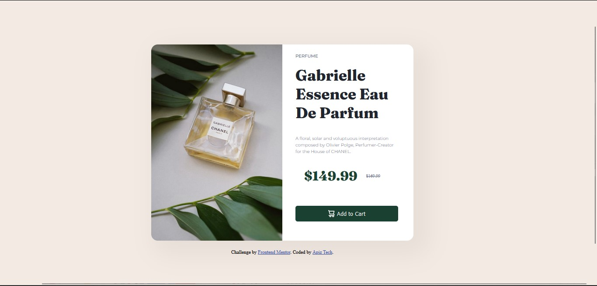

# Frontend Mentor - Product preview card component solution

This is a solution to the [Product preview card component challenge on Frontend Mentor](https://www.frontendmentor.io/challenges/product-preview-card-component-GO7UmttRfa). Frontend Mentor challenges help you improve your coding skills by building realistic projects. 

## Table of contents

- [Overview](#overview)
  - [The challenge](#the-challenge)
  - [Screenshot](#screenshot)
  - [Links](#links)
- [My process](#my-process)
  - [Built with](#built-with)
  - [What I learned](#what-i-learned)
  - [Continued development](#continued-development)
  - [Useful resources](#useful-resources)
- [Author](#author)
- [Acknowledgments](#acknowledgments)

**Note: Delete this note and update the table of contents based on what sections you keep.**

## Overview

### The challenge

Users should be able to:

- View the optimal layout depending on their device's screen size
- See hover and focus states for interactive elements

### Screenshot




**Note: Delete this note and the paragraphs above when you add your screenshot. If you prefer not to add a screenshot, feel free to remove this entire section.**

### Links

- Solution URL: [Add solution URL here](https://your-solution-url.com)
- Live Site URL: [Add live site URL here](https://your-live-site-url.com)

## My process

### Built with

- Semantic HTML5 markup
- CSS custom properties
- Flexbox
- CSS Grid

### What I learned

Use this section to recap over some of your major learnings while working through this project. Writing these out and providing code samples of areas you want to highlight is a great way to reinforce your own knowledge.

To see how you can add code snippets, see below:

```html
<h1>Some HTML code I'm proud of</h1>
```
```css
@media screen and (max-width: 375px) {
    body {
        margin: 0;
        height: 100%;
        width: 100%;
    }
    .section_main {
        display: grid;
        /* align-content: center; */
        width: 370px;
        height: 667px;
    }
    h1 {
        font-size: 38px;
        line-height: 2.5rem;
    }
    .container {
        display: block;
        width: 345px;
        height: 613px;
        background-color: #ffffff;
        /* grid-template-rows: 200px 400px; */
        margin: 15px 15px;
    }
    .image {
        display: block;
        object-fit: cover;
        width: 100%;
        height: 230px;
        border-radius: 15px 15px 0px 0px;
    }
    .prd_description p {
        font-size: 13;
        font-weight: 500;
        line-height: 1.2rem;
        margin: 10px 0px 15px;
    }
    button {
        display: flex;
        margin-top: 30px;
        background-color: #1a4031;
    }
    .btn_cart {
        padding: 10px 100px;
        color: #fff;
    }
    .btn_cart span {
        padding-left: 4px;
    }
}
```
```js
const proudOfThisFunc = () => {
  console.log('🎉')
}
```

If you want more help with writing markdown, we'd recommend checking out [The Markdown Guide](https://www.markdownguide.org/) to learn more.

**Note: Delete this note and the content within this section and replace with your own learnings.**

### Continued development

Use this section to outline areas that you want to continue focusing on in future projects. These could be concepts you're still not completely comfortable with or techniques you found useful that you want to refine and perfect.

**Note: Delete this note and the content within this section and replace with your own plans for continued development.**

### Useful resources

- [Example resource 1](https://www.example.com) - This helped me for XYZ reason. I really liked this pattern and will use it going forward.
- [Example resource 2](https://www.example.com) - This is an amazing article which helped me finally understand XYZ. I'd recommend it to anyone still learning this concept.

**Note: Delete this note and replace the list above with resources that helped you during the challenge. These could come in handy for anyone viewing your solution or for yourself when you look back on this project in the future.**

## Author

- Website - [Product preview card component](https://www.your-site.com)
- Frontend Mentor - [@apizsoftware](https://www.frontendmentor.io/profile/apizsoftware)
- Twitter - [@yourusername](https://www.twitter.com/yourusername)


